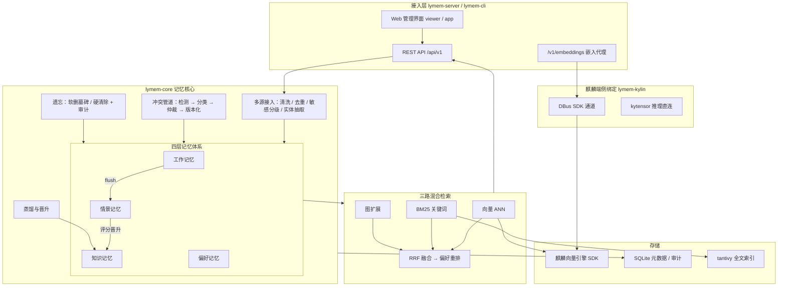
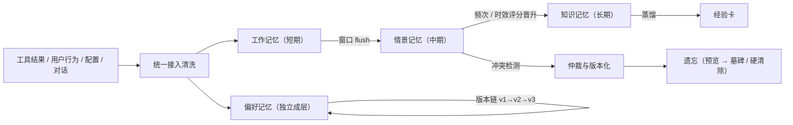

# 麟忆尽智 lymem

> 面向银河麒麟桌面 OS Agent 的记忆优化与高效应用系统（Rust 实现）
> 参赛选题：XA-202612「OS Agent 记忆优化及高效应用研究」

OS Agent 用得越久，越需要一套靠谱的记忆：工具执行结果、用户行为、手动配置、
对话内容都会沉淀下来，但如果只是"存下来"，旧信息会和新信息打架，偏好变了
找不到根据，该忘的忘不掉。lymem 把这件事做成系统能力：四层记忆体系、冲突
调解与版本链、三路混合检索、自然语言遗忘，全部端侧运行。

- 存储与检索走**银河麒麟向量数据库 SDK** 与系统 Embedding 接口（赛题硬性要求）
- 检索全程本机，p50 延迟 24~88ms（赛题线 500ms）
- 知识检索召回 95.1%（赛题线 85%），冲突处理 93.3%（赛题线 88%），
  偏好 99%，记忆能力 91%
- 与 mem0 在同一麒麟嵌入、同一向量引擎、同一生成判分模型下完成六项对照：
  四胜一平一负（详见[评测](#评测结果)）

## 评测结果

全部数字在银河麒麟 V11 实测，逐题明细落盘、可复算。对照口径：mem0 与本系统
使用同一麒麟嵌入、同一向量引擎、同一生成器（MiniMax-M3）与判分器
（deepseek-v4-flash）、同一查询集。

| 指标 | 赛题线 | lymem | mem0 | 说明 |
|---|---|---|---|---|
| 知识检索召回（七站 449 题，hit@5） | ≥85% | **95.1%** | 96.8%* | *mem0 为同嵌入直插向量基线，RAG 口径天花板由共享嵌入决定 |
| 超长对话检索（LoCoMo conv-26，hit@5） | — | **41.7%** | 35.7% | 1380 个记忆点里捞单针 |
| 检索延迟 p50 | ≤500ms | **24~88ms** | ~230ms | 全程本机，含嵌入往返 |
| 知识冲突处理（受控 30 组） | ≥88% | **93.3%** | — | 冲突调解管道闭环正确率 |
| 冲突整合（MAB，EM） | — | **22.0%** | 2.0% | 答案需同时持有冲突双方并整合 |
| 偏好提取（PrefEval MCQ） | ≥85% | **99.0%** | 99.0% | 双通道 + 版本时间线 |
| 记忆能力（MemBench MCQ） | ≥85% | **91.0%** | 88.0% | 含知识更新与比较推理 |
| 长程跨会话（LongMemEval，语义判分） | — | 54.3% | **64.9%** | 唯一落后项，已归因（见路线图） |
| 端到端问答（LoCoMo，EM/语义判分） | — | **14.0 / 33.7** | 8~9 / 23.2 | 检索优势传导到最终答案 |

## 架构



## 记忆流转



## 核心特性

- **多源数据整合**——四类事件（工具结果 / 用户行为 / 配置 / 对话）统一入口，
  清洗、去重、敏感分级、实体抽取一条管线走完；Agent 中枢支持发现并汇聚其他
  终端 agent 的记忆文件，重导幂等
- **偏好动态捕捉与版本化**——规则快通道毫秒级抓显式表述，LLM 慢通道挖隐式
  偏好；每次变化进版本链，支持"回到上周的偏好集合"的时点查询
- **知识冲突调解**——检测、分类、仲裁、版本化四步；仲裁后只出可信值，旧值
  可查证不丢失
- **三路混合检索**——向量 + BM25 + 图扩展，RRF 融合后按偏好重排；三路均有
  开关，评测消融与生产调优用同一套旋钮
- **自然语言遗忘**——"忘掉关于某项目的一切"，先预览受影响集合再执行；
  软删有墓碑可审计，硬清除按需
- **端侧可降级**——向量后端可切 sqlite-vec 开发模式，LLM 未配置自动规则
  兜底，任何一层失效都不阻断记忆主流程

## 快速开始

构建（银河麒麟 V11 默认编入官方向量数据库 SDK 通道）：

```bash
cargo build --release
```

命令行体验：

```bash
# 状态自检：数据目录、麒麟 SDK 通道、向量引擎 socket
./target/release/lymem status

# 接入一条工具执行结果
echo '[{"type":"tool_result","data":{"tool":"libreoffice","task":"doc_edit",
"ok":true,"output":"导出 pdf 成功","scene":"office"}}]' | ./target/release/lymem ingest

# 检索
./target/release/lymem search "pdf 导出"

# 偏好与蒸馏
./target/release/lymem pref list
./target/release/lymem consolidate

# 遗忘：先预览再执行
./target/release/lymem forget "忘掉关于doc_edit的一切" --preview
./target/release/lymem forget "忘掉关于doc_edit的一切" --exec
```

启动服务 + Web 管理界面：

```bash
LYMEM_PORT=8801 ./target/release/lymem-server
# 浏览器打开 http://127.0.0.1:8801/viewer
```

首次使用可在总览页一键灌入演示数据。

## Web 管理界面

| 页面 | 功能 |
|---|---|
| 总览 | 记忆分布、操作热力图、检索延迟示波器、演示数据一键灌入 |
| 记忆库 | 检索、浏览、AI 问答（答案带引用角标，点击高亮来源） |
| 偏好 | 偏好列表与版本时间线，时点回溯 |
| 冲突 | 冲突列表、版本 diff、仲裁操作 |
| 经验卡 | 蒸馏产物：做法、适用条件、踩坑点 |
| 遗忘 | 自然语言遗忘：预览 → 执行 → 审计 |
| 评测 | 七站与四站基准结果、同后端对照条形图、答辩演示模式 |
| 图谱 | 实体关系图，可拖拽缩放 |
| Agent 中枢 | 多源发现、汇聚导入、记忆调度、总索引、巡检 |

## 评测复现

评测驱动与对照脚本：

```text
benchmark/baselines/ppt_bench.py          # 七站数据集（赛题 PPT 第 17 页推荐）
benchmark/baselines/ppt_bench_mem0.py     # 七站 mem0 直插基线对照
benchmark/baselines/run_matrix.py         # 四站记忆矩阵（断点续跑）
benchmark/baselines/run_mem0_locomo.py    # LoCoMo 端到端协议
benchmark/baselines/rejudge_longmemeval.py# 语义判分复评
```

协议要点：检索类全部 hit@5（免 LLM 打分，逐题可复核）；开放题同时报严格
EM 与 LLM 语义判分双口径；对照系统与本系统同嵌入、同引擎、同生成、同判分。
数字汇总见 `benchmark/results/kylin-night/指标对照简报.md`。

## 文档

| 文档 | 内容 |
|---|---|
| [docs/技术文档.md](docs/技术文档.md) | 架构、算法原理、效果验证报告 |
| [docs/用户手册.md](docs/用户手册.md) | 安装、操作、API、运维 |
| [docs/评测指标与数据集对照.md](docs/评测指标与数据集对照.md) | 指标 → 数据集 → 协议 → 数字 |
| [docs/技术问答.md](docs/技术问答.md) | 设计决策与常见质疑的回答 |
| [docs/部署指南.md](docs/部署指南.md) | 麒麟 V11 安装检查、用户级/deb 部署、备份恢复 |
| [docs/设计文档.md](docs/设计文档.md) | 详细设计与实现笔记 |
| [docs/竞赛实施路线图.md](docs/竞赛实施路线图.md) | 剩余工作与优先级 |

## 目录结构

```text
crates/
  lymem-core/     记忆核心：ingest、retrieval、conflict、preference、
                  promotion、forget、sensitive、hub、experience
  lymem-server/   HTTP 服务 + Web 管理界面（viewer/app 内嵌）
  lymem-kylin/    麒麟绑定：DBus SDK 通道、kytensor 直连
  lymem-llm/      OpenAI 兼容 LLM 网关（MiniMax 预设）
  lymem-cli/      命令行工具
  lymem-bench/    评测框架（数据集加载、LoCoMo 驱动）
docs/             部署指南、技术文档、用户手册、评测对照等
```

## 环境变量

| 变量 | 说明 | 默认 |
|---|---|---|
| `LYMEM_PORT` | 服务端口 | 8801 |
| `LYMEM_DATA_DIR` | 数据目录 | `~/.local/share/lymem` |
| `LYMEM_EMBEDDER` | `auto`（麒麟）/ `hash`（离线） | `auto` |
| `LYMEM_VECTOR_BACKEND` | `kylin`（竞赛正式）/ `sqlite`（开发降级） | `sqlite` |
| `LYMEM_LLM_BASE_URL` / `LYMEM_LLM_API_KEY` / `LYMEM_LLM_MODEL` | 外部 LLM（可选） | 不配则规则兜底 |
| `LYMEM_KYLIN_MODEL` | 嵌入模型 | `ensemble-embd_gte-base_uint8-text` |

## 路线图

1. **细粒度记忆单元**——多会话聚合题型上区块记忆吃亏（LongMemEval 聚合
   20% vs mem0 原子事实 62%），计划引入事实级二级索引
2. **MCP 接入**——把记忆读写暴露为 MCP 工具，方便任意 Agent 框架接入
3. **多用户隔离强化**——scene 之上的用户维度配额与隔离审计
4. **敏感模式库**——按政企场景扩充分级规则，支持自定义正则集

---

附录：对照实验里 mem0 的复测脚本、查询集与逐题明细均在 `benchmark/` 目录
（随源代码一同提交），评审可完整复算每一个数字。
