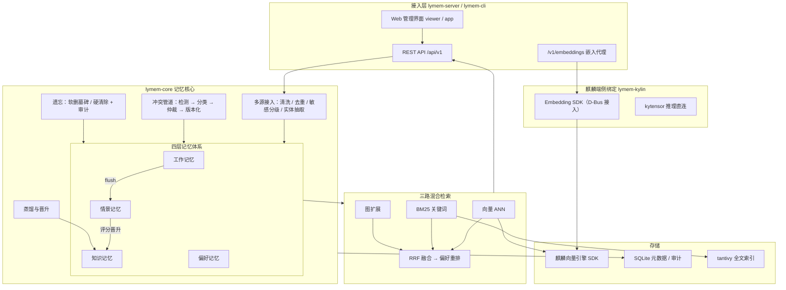
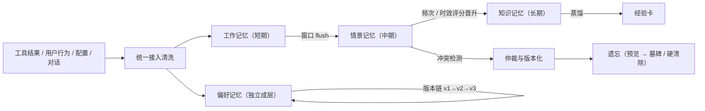

# 麟忆尽智 lymem

> 基于 Agentic RAG 的银河麒麟 OS Agent 记忆优化系统（Rust 实现）
> 参赛选题：XA-202612「OS Agent 记忆优化及高效应用研究」

OS Agent 用得越久，越需要一套靠谱的记忆：工具执行结果、用户行为、手动配置、
对话内容都会沉淀下来，但如果只是"存下来"，旧信息会和新信息打架，偏好变了
找不到根据，该忘的忘不掉。lymem 把这件事做成系统能力：四层记忆体系、冲突
调解与版本链、三路混合检索、自然语言遗忘，全部端侧运行。Agent 通过 MCP
自主选择记忆工具，形成“任务判断 → 检索增强 → 来源证据 → Agent 决策 → 记忆反馈”的 Agentic RAG 闭环。

- 存储与检索走**银河麒麟向量数据库 SDK** 与系统 Embedding 接口（赛题硬性要求）
- 检索全程本机，麒麟向量后端 p50 延迟 40~88ms（赛题线 500ms）
- 知识检索召回 96.6%（赛题线 85%），冲突处理 93.3%（赛题线 88%），
  偏好 99%，记忆能力 91%
- 与 mem0 在同一麒麟嵌入、同一向量引擎、同一生成判分模型下完成六项对照：
  四胜一平一负（详见[评测](#评测结果)）

## 评测结果

全部数字在银河麒麟 V11 实测，逐题明细落盘、可复算。对照口径：mem0 与本系统
使用同一麒麟嵌入、同一向量引擎、同一生成器（MiniMax-M3）与判分器
（deepseek-v4-flash）、同一查询集。

| 指标 | 赛题线 | lymem | mem0 | 说明 |
|---|---|---|---|---|
| 知识检索召回（七站 442 题，hit@5） | ≥85% | **96.6%** | 96.8%* | *麒麟向量后端；mem0 为同嵌入直插向量基线 |
| 超长对话检索（LoCoMo conv-26，hit@5） | — | **41.7%** | 35.7% | 1380 个记忆点里捞单针 |
| 检索延迟 p50 | ≤500ms | **40~88ms** | ~230ms | 麒麟向量后端，全程本机，含嵌入往返 |
| 知识冲突处理（受控 30 组） | ≥88% | **93.3%** | — | 冲突调解管道闭环正确率 |
| 冲突整合（MAB，EM） | — | **22.0%** | 2.0% | 答案需同时持有冲突双方并整合 |
| 偏好提取（PrefEval MCQ） | ≥85% | **99.0%** | 99.0% | 双通道 + 版本时间线 |
| 记忆能力（MemBench MCQ） | ≥85% | **91.0%** | 88.0% | 含知识更新与比较推理 |
| 长程跨会话（LongMemEval，语义判分） | — | 54.3% | **64.9%** | 唯一落后项，已归因（见路线图） |
| 端到端问答（LoCoMo，EM/语义判分） | — | **14.0 / 33.7** | 8~9 / 23.2 | 检索优势传导到最终答案 |

## 架构



## 记忆流转



## 核心特性

- **多源数据整合**——四类事件（工具结果 / 用户行为 / 配置 / 对话）统一入口，
  清洗、去重、敏感分级、实体抽取一条管线走完；Agent 中枢支持发现并汇聚其他
  终端 agent 的记忆文件，重导幂等
- **偏好动态捕捉与版本化**——规则快通道毫秒级抓显式表述，LLM 慢通道挖隐式
  偏好；每次变化进版本链，支持"回到上周的偏好集合"的时点查询
- **知识冲突调解**——检测、分类、仲裁、版本化四步；仲裁后只出可信值，旧值
  可查证不丢失
- **三路混合检索**——向量 + BM25 + 图扩展，RRF 融合后按偏好重排；三路均有
  开关，评测消融与生产调优用同一套旋钮
- **自然语言遗忘**——"忘掉关于某项目的一切"，先预览受影响集合再执行；
  软删有墓碑可审计，硬清除按需
- **端侧可降级**——向量后端可切 sqlite-vec 开发模式，LLM 未配置自动规则
  兜底，任何一层失效都不阻断记忆主流程
- **经验编译器**——情景轨迹先提炼为带证据链和复用门控的经验卡，再编译为标准
  `SKILL.md + resources/manifest.json` 技能目录，可发布到 Codex、Claude Code、
  OpenCode、DeepSeek Harness，并支持版本回滚与移除

## 快速开始

### 方式一：deb 安装（银河麒麟 V11，推荐）

```bash
sudo apt install ./lymem_0.1.0_amd64.deb   # 或 sudo dpkg -i
/opt/lymem/lymem-ctl start                  # 由桌面登录用户执行，勿用 sudo 启动
/opt/lymem/lymem-ctl status
curl http://127.0.0.1:8801/api/v1/health    # {"status":"ok"} 即成功
```

安装内容：`/opt/lymem/`（服务与控制脚本）、应用菜单「麟忆尽智」、登录自启。
卸载 `sudo apt remove lymem`（数据目录保留）。免 root 场景用便携包
`./install-user.sh`，详见[部署指南](docs/部署指南.md)。

### 方式二：源码构建

```bash
cargo build --release --locked
```

命令行体验：

```bash
# 状态自检：数据目录、麒麟 SDK 通道、向量引擎 socket
./target/release/lymem status

# 接入一条工具执行结果
echo '[{"type":"tool_result","data":{"tool":"libreoffice","task":"doc_edit",
"ok":true,"output":"导出 pdf 成功","scene":"office"}}]' | ./target/release/lymem ingest

# 检索
./target/release/lymem search "pdf 导出"

# 偏好与蒸馏
./target/release/lymem pref list
./target/release/lymem consolidate

# 遗忘：先预览再执行
./target/release/lymem forget "忘掉关于doc_edit的一切" --preview
./target/release/lymem forget "忘掉关于doc_edit的一切" --exec
```

### 启动服务 + Web 工作台

```bash
export LYMEM_PORT=8801
export LYMEM_EMBEDDER=auto
export LYMEM_VECTOR_BACKEND=kylin
./target/release/lymem-server
# 另开终端验证正式后端
curl -s http://127.0.0.1:8801/api/v1/status
# 浏览器打开 http://127.0.0.1:8801/app（/viewer 为同一页面）
```

正式验收的状态应包含 `embedder=kylin(auto)`、`embed_dim=768` 和
`vector_backend=kylin-vector-engine`。没有麒麟运行时的开发机可改用
`LYMEM_EMBEDDER=hash LYMEM_VECTOR_BACKEND=sqlite` 进行离线功能开发，
不能将该降级口径作为竞赛性能结果。

首次使用可在总览页一键灌入演示数据。源码安装复核（隔离端口与数据目录）的
完整命令见[部署指南](docs/部署指南.md)。

## Agent MCP 接入

lymem 通过 MCP（Streamable HTTP）向 Agent 暴露 **11 个记忆工具**，
Agent 按任务自主决定何时检索、何时写回，形成
"任务判断 → 检索增强 → 来源证据 → Agent 决策 → 记忆反馈"的 Agentic RAG 闭环。

### 通用 MCP 客户端

任何支持 MCP Streamable HTTP 的客户端，加入：

```json
{
  "mcpServers": {
    "lymem": { "url": "http://127.0.0.1:8801/mcp" }
  }
}
```

### DeepSeek Harness（dsh）

```bash
dsh web --patch lymem.cordis.yml   # lymem.cordis.yml 见 integrations/deepseek-harness/
```

`integrations/deepseek-harness/lymem.cordis.yml` 已写好挂载配置，其余 Agent
（Codex、Claude Code、OpenCode）由技能发布通道自动覆盖，见
[技能编译与 Agent 接入](docs/技能编译与Agent接入.md)。

### 工具一览（tools/list 共 11 个）

| 分组 | 工具 | 作用 |
|---|---|---|
| 检索与写入 | `memory_search` / `memory_add` / `memory_forget` | 混合检索（三路 RRF 融合+偏好重排）/ 写入事件 / 自然语言遗忘（预览→确认） |
| 偏好与经验 | `preference_list` / `experience_list` / `memory_feedback` | 偏好版本查询 / 经验卡列表 / 复用成败回报（驱动门控） |
| 治理状态 | `conflict_list` / `memory_status` | 冲突台账 / 库与后端状态 |
| 编译发布 | `experience_compile` / `skill_targets` / `skill_publish` | 轨迹→经验卡 / 技能目标 / 发布 SKILL.md |

典型用法：Agent 每轮先 `memory_search` 注入相关记忆（经验卡自动提权），
任务结束后用 `memory_feedback` 回报成败，复用 2 次且零失败的经验卡升为
verified 并可 `skill_publish` 编译为技能。

### 手动提炼（REST）

除自动门控外，用户可依据自身偏好直接沉淀经验卡：

```bash
curl -X POST http://127.0.0.1:8801/api/v1/experiences \
  -H 'Content-Type: application/json' \
  -d '{"type":"practice","task":"周报归档","trigger":"每周五生成周报后",
       "steps":["导出 PDF 到 /archive/weekly","按日期命名并登记台账"],"scene":"work"}'
```

手动卡默认 draft，与自动卡同走 `memory_feedback` 门控验证。

## Web 管理界面

| 页面 | 功能 |
|---|---|
| 总览 | 记忆分布、操作热力图、检索延迟示波器、演示数据一键灌入 |
| 记忆库 | 检索、浏览、AI 问答（答案带引用角标，点击高亮来源） |
| 偏好 | 偏好列表与版本时间线，时点回溯 |
| 冲突 | 冲突列表、版本 diff、仲裁操作 |
| 经验卡 | 蒸馏产物：做法、适用条件、踩坑点 |
| 遗忘 | 自然语言遗忘：预览 → 执行 → 审计 |
| 评测 | 七站与四站基准结果、同后端对照条形图、答辩演示模式 |
| 图谱 | 实体关系图，可拖拽缩放 |
| Agent 中枢 | 多源发现、汇聚导入、记忆调度、总索引、巡检 |
| 技能发布 | 经验卡 + 当前偏好 → `SKILL.md`，选择 Agent 一键发布/回滚/移除 |

## 评测复现

评测驱动与对照脚本：

```text
benchmark/baselines/ppt_bench.py          # 七站数据集（赛题 PPT 第 17 页推荐）
benchmark/baselines/ppt_bench_mem0.py     # 七站 mem0 直插基线对照
benchmark/baselines/run_matrix.py         # 四站记忆矩阵（断点续跑）
benchmark/baselines/run_mem0_locomo.py    # LoCoMo 端到端协议
benchmark/baselines/rejudge_longmemeval.py# 语义判分复评
```

协议要点：检索类全部 hit@5（免 LLM 打分，逐题可复核）；开放题同时报严格
EM 与 LLM 语义判分双口径；对照系统与本系统同嵌入、同引擎、同生成、同判分。
数字汇总见 `benchmark/results/kylin-night/指标对照简报.md`。

## 文档

| 文档 | 内容 |
|---|---|
| [docs/部署指南.md](docs/部署指南.md) | 麒麟 V11 安装检查、用户级/deb 部署、备份恢复 |
| [docs/接入指南.md](docs/接入指南.md) | 三种方式把你的 Agent 接入 lymem（hub 汇聚 / REST / 嵌入代理） |
| [docs/技能编译与Agent接入.md](docs/技能编译与Agent接入.md) | 经验卡编译为 SKILL.md 与各 Agent 技能目录发布 |
| [docs/用户手册.md](docs/用户手册.md) | 安装、操作、API、运维 |

## 目录结构

```text
crates/
  lymem-core/     记忆核心：ingest、retrieval、conflict、preference、
                  promotion、forget、sensitive、hub、experience、skill_export
  lymem-server/   HTTP 服务 + MCP 端点 + 统一 Web 用户工作台（app/viewer 同页内嵌）
  lymem-kylin/    麒麟绑定：Embedding SDK 的 D-Bus 接入、kytensor 直连
  lymem-llm/      OpenAI 兼容 LLM 网关（MiniMax 预设）
  lymem-cli/      命令行工具
  lymem-bench/    评测框架（数据集加载、LoCoMo 驱动）
vendor/           麒麟向量数据库 SDK 头文件与链接库（离线构建必需）
integrations/     deepseek-harness、opencode 接入配置
packaging/        deb/便携包打包脚本
data/             演示书源（长文档知识库灌入用）
docs/             部署指南、接入指南、用户手册
```

## 环境变量

| 变量 | 说明 | 默认 |
|---|---|---|
| `LYMEM_PORT` | 服务端口 | 8801 |
| `LYMEM_DATA_DIR` | 数据目录 | `~/.local/share/lymem` |
| `LYMEM_EMBEDDER` | `auto`（麒麟）/ `hash`（离线） | `auto` |
| `LYMEM_VECTOR_BACKEND` | `kylin`（竞赛正式）/ `sqlite`（开发降级） | `sqlite` |
| `LYMEM_LLM_BASE_URL` / `LYMEM_LLM_API_KEY` / `LYMEM_LLM_MODEL` | 外部 LLM（可选） | 不配则规则兜底 |
| `LYMEM_KYLIN_MODEL` | 嵌入模型 | `ensemble-embd_gte-base_uint8-text` |

## 路线图

1. **细粒度记忆单元**——多会话聚合题型上区块记忆吃亏（LongMemEval 聚合
   20% vs mem0 原子事实 62%），计划引入事实级二级索引
2. **多用户隔离强化**——scene 之上的用户维度配额与隔离审计
3. **敏感模式库**——按政企场景扩充分级规则，支持自定义正则集

---

附录：对照实验里 mem0 的复测脚本、查询集与逐题明细均在 `benchmark/` 目录
（随源代码一同提交），评审可完整复算每一个数字。
